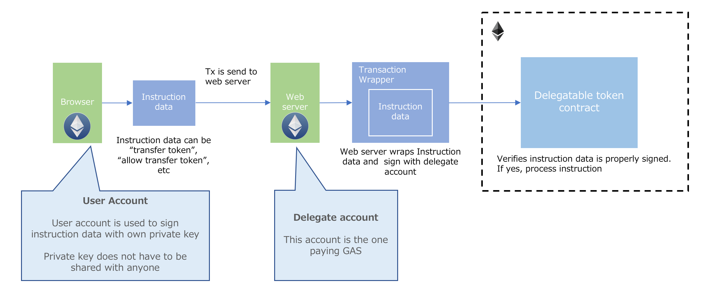
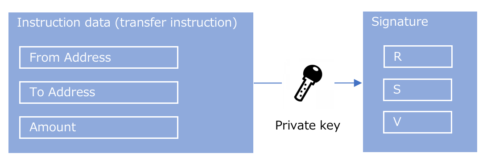
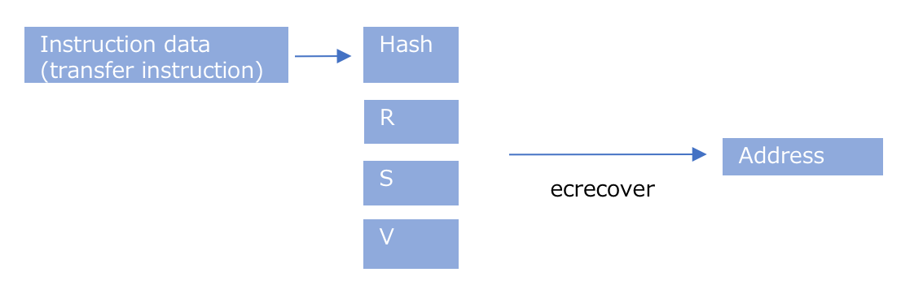

# Concept

This is delegatable ERC20 token.

In normal situation, user has to have some amount of ehter in their wallet to transfer token.
That means, user who wants to use token need to buy ether somewhere and transfer it to their wallet.

This limits token's use case as normal user usually does not have ether and buying and transferring ether to their wallet requires some knowledge and time.

This repository implements concept of Delegatable token which allows token issuer can pay transaction gas instead of owner.
Private key of user's account does not have to be shared with token issuer.

# How it works

Overall concept is describe as below.



- User signs token transfer instruction data with it's private key
- Instruction and signature is then sent to web server
- Web server has it's own account which will pay gas on behalf of user's accounts
- Web server creates ethereum's tx having instruction data and signature as argument for smartcontract's method call
- Smartcontract recover user account address from signature and data
- Smartcontract operates instruction only if signed user and user specified inside of data matches

With this scheme, the worst thing web server can do is to dispose transfer instruction.
If web server changes instruction data before sending it to ethereum's network, recovered user account's address does not match with the address embedded in instruction data.

## signing at user



Token transfer instruction data needs to have `From address` `To address` and `Amount`.
Those data is combined and signed with it's private key.
Generated signature and data is then send to web server

## operation at web server

Web server create normal ethereum's tx having data and signature as smartcontract's method argument.

## operation at smartcontract



Smartcontract recovers address of singed user by signature and data

```
bytes32 h = keccak256(byte(0x19), byte(0), this, nonce[sender], data);
address signer = ecrecover(h, sigV, sigR, sigS);
```

Recovered address is then compared with `From address` embedded in data itself.

```
// function to retreive embedded address in data
function decodeSender(bytes b) internal constant returns (address from) {
    assembly {
        from := mload(add(b, 20))
    }
}
```

If those address matches, smartcontract will do token transfer based on instruction data.

# Setup 

## Prepare env file

```
$ cp ./app/.env.example ./app/.env
```

## Build container

```
$ sh script/dev/build.sh
```

## Start container

```
$ sh script/dev/start.sh
```

## Test node app

```
$ sh script/test/start.sh
```

# API

T.B.D

